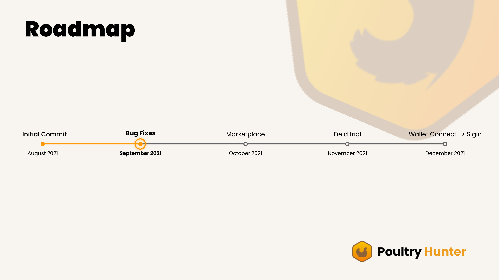

[](https://github.com/Poultry-Hunter/poultry-hunter-app/blob/main/LICENSE) [](https://github.com/Poultry-Hunter/poultry-hunter-app/issues) [](https://poultryhunter.netlify.app/)

## Contents

- [Description](#Description)
- [Demo Video](#Demo-Video)
- [Roadmap](#Roadmap)
- [Getting Started](#Getting-Started)
- [Live Demo](#Live-Demo)
- [Built With](#Built-With)
- [Program Releases](#Program-Releases)
- [Contributors](#Contributors)
- [License](#License)


## Description

While the Poultry supply chain becomes more complex, the **Rapid Tracing of bird diseases** like bird flu becomes **near to impossible**, in most cases it takes <u>months</u>! And long tracing time leads to:

1. **Significant loss** to the <u>entire supply chain</u>.
2. **Delay** in <u>containment</u>.
3. And above all **increase in disease transmission** both in humans and birds.

Complexity in the food-related Supply chains also introduces <u>economic inefficiency</u> at every point of transactions, be it a poultry farmer or a distributor.


Therefore, a decentralised system is required that tracks every point of Poultry transaction with an intuitive rather technology minimal medium that can trace bird disease as well as maximise efficiency in operations at every level, from Poultry farm to Chicken Butcher/seller.

 Introducing **Poultry Hunter**, a **blockchain-based** farm to butcher/seller <u>chicken tracker</u> that **rapidly traces bird flu** while also providing a <u>platform</u> to **maximise operational efficiency**. 


## Demo Video
[](https://youtu.be/4hFYPGZmTtA)


## Roadmap




## Getting Started

### Testing on a local server

```shell

# Install rust
curl --proto '=https' --tlsv1.2 -sSf https://sh.rustup.rs | sh
sh -c "$(curl -sSfL https://release.solana.com/v1.7.11/install)"

# Clone repo
git clone https://github.com/Poultry-Hunter/poultry-hunter-app.git
cd poultry-hunter-app/

# Install dependencies and build solana progarm
npm install
npm run build:program-rust

# Start a local node cluster and deploy program.
solana-test-validator
solana program deploy /<YourPath>/poultry-hunter-app/dist/program/poultry_hunter.so 

# Add program id in our app and run react server.
copy programid and paste in /poultry-hunter-app/src/utils/utils.ts
npm start

```

## Live Demo

You can find a working demo at [PoultryHunter.netlify.app/](https://poultryhunter.netlify.app/).


## Built With

- [Solana](https://solana.com/) - Solana is a decentralized blockchain built to enable scalable, user-friendly apps for the world.
- [React](https://reactjs.org/) - React is a free and open-source front-end JavaScript library for building user interfaces or UI components.
- [Phantom](https://phantom.app/) - Phantom is a digital wallet reimagined for DeFi. Phantom makes it safe & easy for you to store, send, receive, collect, and swap tokens on the Solana blockchain.
- [Solflare](https://solflare.com/) - SolFlare is a community-created web wallet built specifically for Solana. 
- [Web3](https://solana-labs.github.io/solana-web3.js/) - web3. js is a collection of libraries which allow you to interact with a local or remote blockchain node.

## Program Releases

- [Solana Devnet](https://explorer.solana.com/?cluster=devnet)
- [View On Solana Explorer](https://explorer.solana.com/address/H2bq5hQFMpAPM7qD2gLMnLx6FN278MkAHKNHx1hcbaMB?cluster=devnet)

```json
{
  "devnet": {
    "ProgramId": "H2bq5hQFMpAPM7qD2gLMnLx6FN278MkAHKNHx1hcbaMB"
  }
}
```

## Contributors

<a href="https://github.com/Poultry-Hunter/poultry-hunter-app/graphs/contributors">
  
</a>


## License

This project is licensed under the MIT License - see the [LICENSE](LICENSE) file for details.

